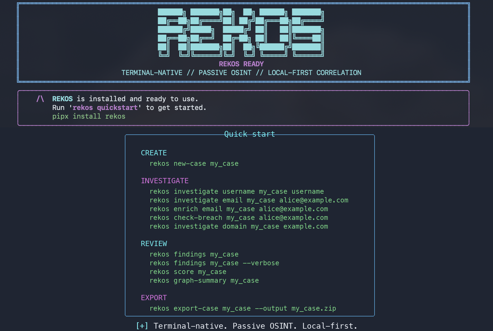

# REKOS


REKOS is a terminal-native passive OSINT CLI for local-first public-source investigation workspaces. It helps organize targets, evidence, source outputs, entities, relationships, normalized findings, and correlation-quality scores in a SQLite-backed case folder.

REKOS is designed for passive public-source workflows:

- Public-source investigation workspace
- Target and evidence organizer
- Username, profile, domain, URL, and indicator correlation tool
- Local-first OSINT case workspace
- No login automation, bypass, credential collection, or active exploitation

A case is a local workspace for one public-source research thread. Cases are stored under `~/rekos_cases/<case_name>` by default. Each case keeps its own SQLite database, source outputs, evidence artifacts, graph records, findings, and exports.

## Installation

REKOS requires Python >=3.10. Python 3.12 is recommended.

Install with pipx and Python 3.12:

```bash
pipx install rekos --python python3.12
```

If your default Python is already >=3.10, plain `pipx install rekos` is also supported.

### Windows PowerShell

On Windows, `pipx` may not be installed by default. If you do not have `pipx`
available, install REKOS with Python's `py` launcher:

```powershell
py -m pip install --upgrade pip
py -m pip install rekos
rekos version
rekos quickstart
```

If the `rekos` command is not on your PATH yet, verify the package and run the
module fallback:

```powershell
py -m pip show rekos
py -m rekos version
```

Run `rekos` with no arguments to open the quickstart screen.

Users run REKOS commands such as `rekos investigate username <case> <username>` and `rekos investigate domain <case> <domain>`. REKOS calls available passive sources through its source adapters and continues cleanly when optional external tools are absent.

Install from a local checkout:

```bash
git clone <repo-url>
cd rekos
pipx install .
rekos --help
```

For development, use an editable install:

```bash
git clone <repo-url>
cd rekos
python -m venv .venv
. .venv/bin/activate
python -m pip install -e ".[dev]"
pytest
rekos --help
```

## Optional Integrations

- `sherlock` enables the `sherlock_username` source when the `sherlock` command is installed
- `maigret` enables the `maigret_username` source when available in the REKOS runtime
- `exiftool` or `mediainfo` for file metadata collection
- Playwright is optional for URL screenshots; HTTP snapshots still work without it

Users always run `rekos`, not Sherlock or Maigret directly. `rekos investigate username <case> <username>` automatically uses the username sources available in the current environment.

## Quick Start

```bash
rekos new-case social_test
rekos investigate username social_test username
rekos findings social_test
rekos findings social_test --verbose
rekos score social_test
rekos graph-summary social_test
rekos export-case social_test --output social_test.zip
```

Normal workflow:

1. Create a case with `rekos new-case`.
2. Add or investigate a target with `rekos investigate username`, `rekos investigate domain`, or `rekos snapshot-url`.
3. Review normalized results with `rekos findings`.
4. Score correlation quality with `rekos score`.
5. Inspect relationships with `rekos graph-summary` or `rekos list-entities`.
6. Export the workspace with `rekos export-case`.

Most users only need these commands:

```bash
rekos
rekos quickstart
rekos new-case acme-osint
rekos investigate username acme-osint alice.example
rekos investigate domain acme-osint example.com
rekos snapshot-url acme-osint https://example.com/profile/alice
rekos findings acme-osint
rekos findings acme-osint --verbose
rekos score acme-osint
rekos search acme-osint example.com
rekos graph-summary acme-osint
rekos export-case acme-osint --output ./acme-osint.zip
```

Use `rekos findings <case> --verbose` for grouped analyst detail. Add `--show-uuids` only when full finding IDs are needed.

Users run only `rekos`. Sherlock and Maigret are optional integrations that REKOS orchestrates internally when available.

During `rekos investigate username <case> <username>`, REKOS generates safe username variants, runs available passive username sources, stores raw source output, normalizes discovered profile URLs into findings, updates the entity graph, records timeline events, and computes correlation-quality scores. Results are correlation indicators, not proof of identity ownership.

During `rekos investigate domain <case> <domain>`, REKOS runs passive DNS, RDAP with registry/WHOIS fallback, HTTP/HTTPS endpoint checks, TLS certificate metadata collection, and crt.sh certificate transparency lookup when available. It records registration evidence, DNS records, web endpoint metadata, redirects, TLS certificate summaries, SPF/mail-security summaries, provider hints from TXT records, and certificate transparency findings.

Domain, URL, and snapshot workflows reject localhost, private/internal IP ranges, link-local addresses, metadata-service IPs, reserved, multicast, and unspecified IP targets. REKOS is for public-source targets only.

## How REKOS Works

- Target input: user-provided usernames, domains, URLs, files, notes, and indicators are stored in a local case.
- Source orchestration: REKOS runs passive adapters such as username sources, DNS, RDAP/WHOIS fallback, web/TLS checks, crt.sh, Wayback, metadata tools, and HTTP snapshots when available.
- Findings normalization: raw source output is converted into normalized findings such as discovered profiles, URLs, domains, metadata records, archive records, and registration records.
- Graph correlation: entities and relationships connect usernames, profiles, domains, URLs, files, and notes.
- Quality scoring: REKOS scores correlation quality from source confidence, exact or normalized matches, duplicate source confirmation, evidence presence, and graph relationships.
- Evidence export: raw outputs, artifacts, reports, SQLite data, and manifests can be exported with `rekos export-case`.

## Supported Sources

| Source              | Target types    | Dependencies                     | Notes                                                                           |
|---------------------|-----------------|----------------------------------|---------------------------------------------------------------------------------|
| `sherlock_username` | `username`      | `sherlock` binary                | Runs Sherlock with safe subprocess arguments and parses public profile URLs.     |
| `maigret_username`  | `username`      | optional `maigret` package/tool  | Runs Maigret when installed; REKOS continues without it.                        |
| `wmn_username`      | `username`      | none                             | Checks local public profile URL templates with conservative passive HTTP validation. |
| `http_snapshot`     | `url`           | none                             | Captures public HTTP response artifacts and optional Playwright screenshot.      |
| `rdap_domain`       | `domain`        | none                             | Uses public HTTPS RDAP lookup with registry and WHOIS fallback where available.  |
| `dns_domain`        | `domain`        | none                             | Fetches public DNS A/AAAA/MX/NS/TXT records and extracts SPF/provider hints.     |
| `web_domain`        | `domain`        | none                             | Performs passive HTTP/HTTPS endpoint and TLS certificate metadata checks.         |
| `crtsh_domain`      | `domain`        | none                             | Queries the public crt.sh certificate transparency endpoint.                     |
| `wayback_url`       | `url`, `domain` | none                             | Queries public Wayback CDX data and records archive URLs.                        |

Source utilities:

```bash
rekos sources list
rekos sources check
rekos sources run acme-osint rdap_domain example.com
```

## Core Commands

```bash
rekos add-entity acme-osint --type domain --value example.com
rekos relate-entities acme-osint --from <entity_uuid> --to <entity_uuid> --type related_to --confidence medium
rekos list-targets acme-osint
rekos list-sources acme-osint
rekos show-investigation acme-osint
rekos report acme-osint --format md
```

## Safety And Ethics

REKOS is passive-only OSINT tooling. Use it only for lawful, authorized, and ethical public-source research.

REKOS must not be used for:

- Logging into accounts or automating authenticated sessions
- Bypassing access controls, paywalls, CAPTCHAs, bot protection, or rate limits
- Credential collection, phishing, account abuse, or social engineering
- Exploitation, destructive operations, or aggressive crawling
- Claiming identity ownership from correlation results

Scores are correlation-quality indicators only. A high score means stronger local correlation support, not proof of identity, ownership, compromise, or intent.

## Local Data Model

REKOS stores:

- Case metadata in SQLite
- Targets, entities, relationships, notes, timeline events
- Raw source outputs under `exports/`
- Evidence and snapshot artifacts
- Normalized findings with correlation-quality scores
- Case ZIP exports with manifest data

## Development

```bash
python -m pip install -e ".[dev]"
pytest
rekos --help
```

Before submitting a change:

```bash
pytest
python -m compileall rekos
git diff --check
```

## Roadmap

- More passive source adapters with explicit safety boundaries
- Stronger report templates and case export validation
- Improved graph summaries and finding explainability
- Better import/export interoperability
- Optional UI views while keeping the CLI and local-first storage as the core

## License

MIT License. See [LICENSE](LICENSE).
